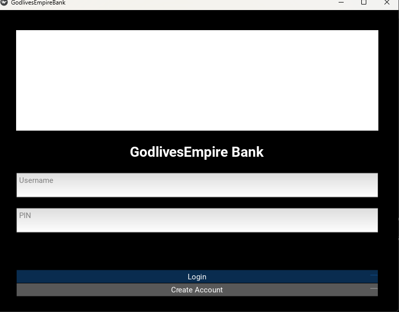
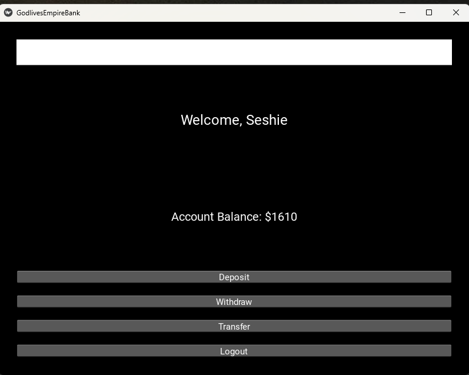

# GodlivesEmpire BankApp(Python + Kivy)
A simple yet powerful desktop banking application built with Python and Kivy 
This  project demonstrates real-world concepts such 
as aunthentication, account creation, secure PIN handling, deposit, withdrawal, transfer using
account numbers, and persistent data storage.

# Features
. User account creation with unique account numbers
. Secure PIN-based auitentication 
. Deposit fund 
. withdraw funds with balance validation 
. Transfer money using account number
. Persistent storege using Kivy ScreenManager
. Beginner-friendly.modular Python code 

# Screenshots
##Screenshots of the application UI

## Project Structure

BankApp/
main.py 
screen
assets= Screenshot/
data= users.json

# Installation & Setup
## clone the repository
git  clone 
https://github.com/GodlivesEmpire/BankApp.git
cd BankApp

## Create a virtual environment
python -m venz venz
source venv/bin/activate 

## Install dependencies
pip install kivy

if Kivy fails tom install, refer to the official guide:
https://kivy.org/doc/stable/gettingstarted/installation.html

# Running the Application
python main.py

## The app will open as a desktop window.

# Security Notes
. User PIN are stored locally (for learning purposes).
. Sensitive files and vault utilities are excluded using .gitignore.
. This project is educational and not intended for real banking use.

# What i Learned From This Project
. Python file handling and json persistence
. Kivy ScreenManager navigation
. Modular backend logic (account, transfer, withdraw)
. Git and GitHub workflow
. Secure handling of sensitive data (ignoring secrets)
. Project structuring for real word apps

# Technologies Used
. Python 3
. Kivy
. Git and GitHub
. JSON

# Future Improvements
. Password hashing
. Transaction history
. Mobile (APK) build
. Database integration (SQLite)
. UI/UX redesign with Figma

# Author

## Seshie Emmanuel
Founder - Godlives Empire

# Support
if you find this project useful, please starthe repository
and feel free to fork or contribute

# Licence
This project is licensed for educational use

